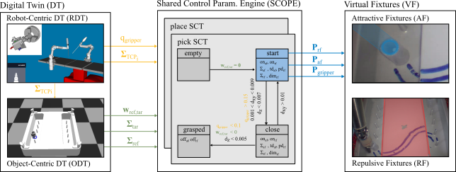

# Contextual Assistance in Surgical Robotics Training with a Digital Twin

Katharina Hagmann, Anja Hellings-Kuß, Julian Klodmann, Rebecca Richter, Freek Stulp and Daniel Leidner

under review in *Frontiers in Robotics and AI*

### Overview

<p align="center">

<p>


### Abstract

Minimally invasive robotic surgery copes with some disadvantages for the surgeon of minimallyinvasive surgery while preserving the advantages for the patient. Most commercially availablerobotic systems are telemanipulated with haptic input devices. The exploitation of the hapticschannel, e.g. by means of Virtual Fixtures, would allow for an individualized enhancement ofsurgical performance with contextual assistance. However, it remains an open field of researchas it is non-trivial to estimate the task context itself during a surgery. In contrast, surgical trainingallows to abstract away from a real operation and thus makes it possible to model the taskaccurately.The presented approach exploits this fact to parameterize Virtual Fixtures during surgicaltraining, proposing a Shared Control Parametrization Engine that retrieves procedural contextinformation from a Digital Twin. This approach accelerates a proficient use of the robotic systemfor novice surgeons by augmenting the surgeon’s performance through haptic assistance. Withthis our aim is to reduce the required skill level and cognitive load of a surgeon performingminimally invasive robotic surgery.A pilot study is performed on the DLR MiroSurge system to evaluate the presented approach.The participants are tasked with two benchmark scenarios of surgical training. The execution ofthe benchmark scenarios requires basic skills as pick, place and path following. The evaluation ofthe pilot study shows the promising trend that novel users profit from the haptic augmentationduring training of certain tasks. 

## Description
  
  This repo contains the data set recorded during the pilot user study, the scripts to calculate the mean and standard deviation of the presented data and to plot   the data. 
  It is required to run the evaluation scripts using Python 2.7. 
  The generated plots are saved in the folder `plots` within this repo.

Before running please adapt following parameters (line 30 ff)
  
```
PLOT_SPLINE = True 	## if True plot second benchmark, if False plot first
CONTROL = True		## if True plot control group	
```


### Citation

If you find our work useful for your research, please consider citing

```
add Citation if it gets accepted
```
